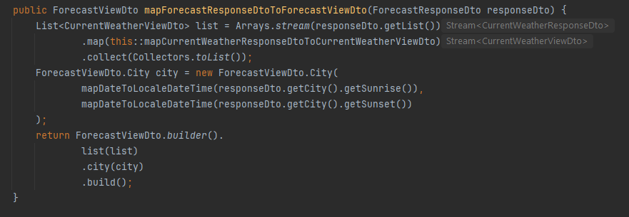

<h1 align="center"> Ofertownia 

</h1> 

<h3 align="center">Technologies used:</h3>

<h1 align="center">

</h1> 

  

  

<h3 align="center">
  Offer service training full stack project implementing several mechanisms like user verification, authorization, data validation on different levels, use of outer weather forecast API and custom API implementation for offer management
</h3>

  

<h2 align="center">

</h2>

<h2 align="center">
 
  <a href="https://ofertownia.codingproductions.com/" target="_blank">
    <h1>View Live Demo</h1>
  </a> 
  <a href="#">(please contact me for login credentials details)</a> 
</h2>

  

## Table Of Content
<ol>
    <li>
      <a href="#about-the-project">About The Project</a>
      <ul>
        <li><a href="#built-with">Built With</a></li>
      </ul>
    </li>
    <li>
      <a href="#some-of-solutions-worth-checking-out">Some Of Solutions Worth Checking Out</a>
      <ul>
        <li><a href="#spring-security-configuration">Spring Security Configuration</a></li>
        <li><a href="#registration-and-validation">Registration And Validation</a></li>
        <li><a href="#admin-panel">Admin Panel</a></li>
        <li><a href="#weather-panel">Weather Panel</a></li>
      </ul>
    </li>
    <li>
      <a href="#project-expansion-plans">Project Expansion Plans</a>
      <ul>
        <li><a href="#file-handling">File Handling</a></li>
        <li><a href="#filtering-offers-by-category">Filtering Offers By Category</a></li>
        <li><a href="#managing-categories-and-offers">Managing Categories And Offers</a></li>
        <li><a href="#unit-testing">Unit testing</a></li>
      </ul>
    </li>
  </ol>

   
## About The Project

  

This is one of my training projects still developed as a means of progressing in the area of full stack programming in Java related technologies.   It is supposed to become a full-fledged online offer service (not a real commercial one though) in the near future. At this point it plays the role of a base for implementing mechanisms mentioned in the [main description](#implemented-mechanisms).   
The application has been deployed on the public Linux server (VPS, Debian) (https://ofertownia.codingproductions.com/). 

At this point project's UI is held in Polish language as a part of simulating challenges related to development of the project contracted by a non-English speaking client. 

  

 
### In this application you can:

- login with one of 3 available roles (user, admin, super admin) (passwords encrypted with Bcrypt hashing function before storing in database)
- register a new account (with the user role)
- reset a password with the resetting link sent via email
- edit the details of the logged in user
- use the admin panel (available for admins and super admins only)
  - admins can promote users to admin roles and/or degrade them back to user role
  - super admins are also entitled to delete any user or admin from the database
- view simple product/offer details (along with their photos - resourced from the Internet though, not from locally saved files at this point)
- view the list of categories and their brief details, also the current offer number
- add a new product with Internet resourced photo (available for admins and super admins only)
- filter/search the offers by name
- view the weather module using the actual outside API resources from OpeanWeather.org
  - view the current weather conditions in any Polish city (weather icons bar is draggable, **also on smartphones**, which is useful in case of projecting the page on narrow screen devices)
  - view the weather forecast for the upcoming 5 days (expandable page elements)
  - view additional weather conditions details in the form of off-canvas effect
- use API endpoints (JSON based) at https://ofertownia.codingproductions.com domain to:
  - download a signed JWT (JWS) token once you provide the correct credentials to further use it to authorize other endpoint requests - **/api/v2/auth** (POST method)
  - download the details of all the current offers from database - **/api/v2/offers** (GET method)
  - download the details of all the current offers from database filtered by name, e.g. by phrase "tele" - **/api/v2/offers?title=tele** (GET method)
  - get current offer number - **/api/v2/offers/count** (GET method)
  - get the details of the particular offer by its ID - **/api/v2/offers/{id}** (GET method)
  - save new offer - **/api/v2/offers** (POST method)
  - delete a particular offer by its ID - **/api/v2/offers/{id}** (DELETE method)
  - use signed (HMAC algorithm with SHA-256 function and with private key generated using java.util.UUID class) JWS tokens for verification and authorization

(<a href="#readme-top">back to top</a>)

---

### Built With

| Technology / Language     | Description |
| -----------: | ----------- |
| | Spring boot 3.1.2, Spring Data JPA, Spring MVC|
| | For user verification, authorization and resources accessibility configuration|
||Oracle JDK 21.0.3|
||To significantly reduce a code bloat|
| | For building several pages dynamically and with the use of Ajax and server API, for client side data validation during new account registration, for API usage when modifying user role level or deleting users in admin panel and for making the weather module use draggable, properly positioned elements|
|| Especially for data validation purposes, both in Java and JavaScript |
||For validation of tables generated by Liquibase|
|  | For loading test data to tables |
| | Used as a database for 'dev' profile |
|| For database migrations |
|| Used as part of Spring MVC to build dynamic server web pages|
|  | Pretty extensive use of HTML 5 and CSS 3 capabilities |
| | Version 4.1.3, used extensively for styling tables and other page elements |
| | Github used as a remote repository both for my local OS (Windows) repository and for VPS OS (Debian) repository |
| |Installed on remote VPS. Dockerfile used for multi-stage build (Maven image to build JAR file and JDK image to run the actual application container). MySQL container used an external database engine. Also Nginx Proxy Manager container used for port forwarding and for HTTPS SSL |
 | Debian GNU/Linux 12 (bookworm) used as a Virtual Private Server (VPS) |
| |Bash script for automation of application container full restart (image rebuild, container stoppage, removal and restart based on newly built image)|

(<a href="#readme-top">back to top</a>)

## Some Of Solutions Worth Checking Out

### Spring Security Configuration

I managed to get this application combine 2 different approaches to user session management. I needed the user to be able to operate on most application endpoints in the Internet browser with the use of CSRF protection and login pages. This approach requires the user session to be maintained for any user request.  I also needed to provide the user with the possibility to use the API that I built for /api/v2/offers based endpoints and for signed JWT (JWS) tokens to be used (to obtain the signed JWS token you need to send POST request to /api/v2/auth with JSON containing 'username' and 'password' fields combined with correct credentials). This approach required the user session to be omitted.  I managed to overcome this clash by using 2 nested static classes (both annotated with @Configuration) ordered with @Order annotation. This allowed the application for holding the user session for below shown endpoints (here is just the fragment), for keeping CSRF protection and Spring Security Basic Authentication (using login pages requiring the user to provide the proper credentials to establish the session) and for client side JavaScript to properly attach CSRF token cookies as X-XSRF HTPP request header:

  

  

  

  

... while keeping a different approach for **/api/v2/offers** based endpoints:

  

  

  
This is how to obtain a signed JWS token (valid for 30 days):

  

... and how to further use it to get an example data from API endpoint (in this case from /api/v2/offers?title=tele which obtains all offers with their name containing the phrase "tele")

  

(<a href="#readme-top">back to top</a>)

### Registration And Validation

To allow the user to register a new account with the proper field values I implemented a 4-level data validation using different mechanisms:

- client side (web browser JavaScript validation)
- server controller methods side (both for page requests and for API requests)
- Spring Data JPA side (validation right before saving the data to database)
- Liquibase column constraints 

Validation rules:

- all fields must not be null
- first name and last name must have at least 3 characters
- postal code must comply with Polish format XX-XXX (where X is a digit 0-9)
- email address must have a standard format and must not duplicate any email address already existing in database
- password must be at least 8 characters long, have at least one uppercase letter, one lowercase letter and at least one special character
- terms agreement checkbox must be checked

  
Client side validation comprises of a pretty complex JavaScript code as well as RegEx as per below posted fragments:

  

  

  
Server controller methods side uses Bean Validation annotations in DTO class (pl.ofertownia.security.user.dto.UserRegistrationDto), both built-in and custom-built ones (@MinOneLowerCaseChar, @MinOneUpperCaseChar, @MinOneSpecialChar, @PostalCode).

  

  

  

If the user by any chance has JavaScript disabled in the browser the server controller method register() checks both DTO fields compliance with Bean Validation annotations as well as checks whether the email address, that the client is trying to register as their username, has already been used by another user or not. In case any of Bean Validation constraints is breached or the user is unknowingly trying to register a pre-existing email address, the controller method will redirect the user back to rejestracja.html form.

  

  

I implemented JavaScript code in such a way that anytime the user corrects the validated field in at least one of expected aspects (e.g. adds a missing special character) the related error message will disapear, leaving only the remaining error messages visible or, if all the field expected rules are met, the field turns its color from red to green on the fly.

  

(<a href="#readme-top">back to top</a>)

### Admin Panel

Admins and super admins have access to the admin panel. Admins are entitled to promote users to admin role or degrade any admin back to the user role. Super admins are furthermore entitled to delete any user or admin (but not super admin, including himself) from the database. Delete buttons are visible for super admins only.  Both user rights and user deletion are implemented in a way allowing on-the-fly operation. One click on the user rights switch or on the delete button and thanks to Ajax function the operation is instantly performed on the server side and, when completed, JavaScript (admin.js) modifies the page accordingly. User rights badge turns from "Administrator" (admin) to "Użytkownik" (user) (or the other way around). In case deletion button is used JavaScript code removes the respective row from the table.

  

When super admin attempts to delete the user the off-canvas confirmation panel shows up:

  

After degrading the first user to the user role and after deleting the last user on the list it looks like this:

  

  

(<a href="#readme-top">back to top</a>)

### Weather Panel

As a source of meteorological data I used OpenWeather.org. I narrowed down the spectrum of cities to Polish ones. If the user enters a city name that does not exist in Poland a proper error message will appear:

  

When the correct Polish city name is entered the standard weather view appears:

  

The weather forecast for the upcoming 4 days is presented with the use of Bootstrap accordion expandable element and some JavaScript code (weather.js) (below you can see its fragments) for making the weather icon bars draggable (you can check this on narrow screen devices) and for necessary dynamic dimension calculations (draggable child element's and its container's dimensions depend on the current size of the parent element and hence on the current browser window size):

  

  

  

I adjusted the presented weather data reading time to CET time zone.
  
On the page bottom I implemented a button that you can use to project an off-canvas view with additional weather information:

  

Multiple DTO classes and stream-based processing were needed to properly map data from OpenWeather.org API to be useful in a way that I wished it to be. Project Lombok helped me a lot to avoid a code bloat.

  

  

I used 2 OpenWeather.org API endpoints. One for the current weather conditions and the other one for 5-day forecast:

  

Stream processing was of great help for me:

  

  

  

As mentioned earlier to get the current weather condition details I used OpenWeather.org enpdoint **/data/2.5/weather?q={cityName},pl&units=metric&lang=pl&appid={apiKey}** with the desired parameters and then mapped the results to suit my needs. These are the fragments of the solution:

  

  

  To obtain weather forecast for the current day however I used another API endpoint **/data/2.5/forecast?q={cityName},pl&appid={apiKey}&lang=pl&units=metric** that allows to get 5-day forecast and then I narrowed down the obtained list to 9 elements that roughly cover the upcoming 24 hours (taking into consideration that this API endpoint provides forecast samples with 3-hour intervals):

  

  

To obtain the weather details for the remaining 4 days I used the original full 5-day weather forecast list, filtered out (by date) data pertaining to the current day and created a map with Strings containing abbreviated date details as keys and with Lists of DTOs (**pl.ofertownia.api.weather.CurrentWeatherViewDto.WeatherTempIconUrlTime**) containing details about temperature, time, day of the week and the weather icon string (that could further be used to build a link that allows to place the actual icons in the draggable weather icon bar on the web page) as the map values (**Map<String, List<CurrentWeatherViewDto.WeatherTempIconUrlTime>>**):

  

(<a href="#readme-top">back to top</a>)

## Project Expansion Plans

### File Handling

At this point when admin or super admin needs to add a new offer there is this "URL obrazka" (image URL) field available only. It allows to outsource any image from the Internet but you need to put its URL in the field. It is not possible to browse the local system files, add a chosen file as a new desired image file and to save it on the server. 

File handling mechanism still needs to be implemented just like the one in another project of mine (https://github.com/maciej-mazur-github/kulinaria).

(<a href="#readme-top">back to top</a>)

### Filtering Offers By Category

Currently any logged in user can view the list of all categories along with the number of offers per each category and with short category description. It is not possible though to click on a chosen category to see the list of offers in it.

(<a href="#readme-top">back to top</a>)

### Managing Categories And Offers

Allowing admins and super admins to fully manage (add, modify, delete) categories and offers (adding a new offer has already been implemented though) would be nice. Hence my plan is to expand this project by these options.

(<a href="#readme-top">back to top</a>)

### Unit Testing

Unit tests still need to be implemented.

(<a href="#readme-top">back to top</a>)

